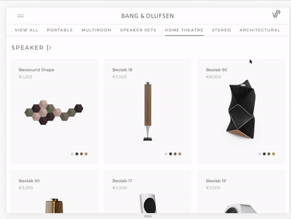
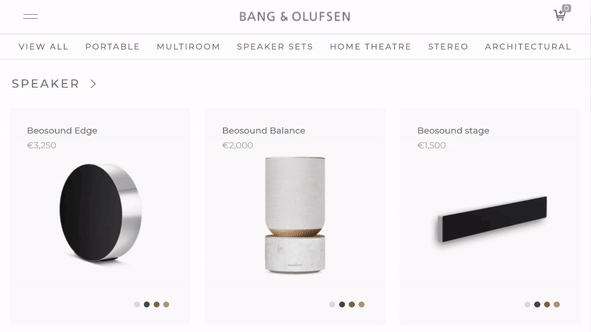
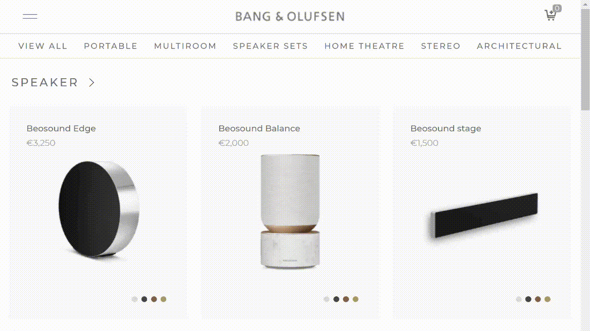
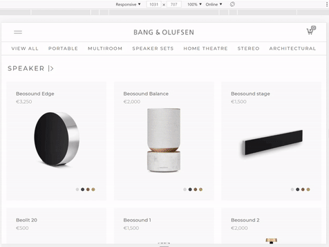
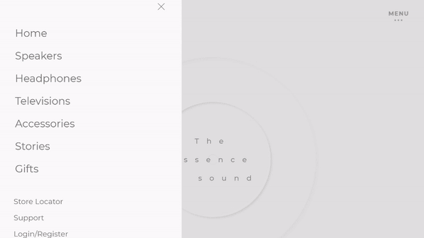

# :pushpin: bang-olufsen

> 뱅앤올룹슨 웹사이트 리디자인 (개인 프로젝트)  
> https://yooneunheo.github.io/bang-olufsen/

 

## 1. 제작 기간 & 참여 인원

- 2020년 12월 27일 ~ 2021년 02월 01일
- 개인 프로젝트

 

## 2. 사용 기술

- HTML
- CSS
- Vanilla JS

 

## 3. 주요 기능

덴마크의 전자 회사 뱅앤올룹슨 웹사이트를 리디자인하였습니다.
메인화면, 카테고리, 제품 상세, 로그인, 지점 찾기 등 총 다섯 페이지를 제작했습니다.

<b>주요 기능 설명 펼치기</b>

### 3.1. 반응형 웹 디자인

 
 

### 3.2. 필터링

- **필터링** :pushpin: [코드 확인](https://github.com/yooneunheo/bang-olufsen/blob/main/js/filtering.js)

  - HTML5의 `data-*` 속성을 이용하여 각 제품을 카테고리에 맞게 분류합니다.
  - 카테고리를 선택하면 그에 해당하는 제품만 볼 수 있도록 클래스를 추가합니다.

   

### 3.3. 장바구니

- **비동기처리** :pushpin: [코드 확인](https://github.com/yooneunheo/bang-olufsen/blob/main/js/cart.js#L18)

  - Fetch API를 이용하여 [모든 제품 정보를 담은 JSON 형식의 데이터](https://github.com/yooneunheo/bang-olufsen/blob/main/products.json)를 불러옵니다.

- **클래스** :pushpin: [코드 확인](https://github.com/yooneunheo/bang-olufsen/blob/main/js/cart.js#L37)

  - 장바구니 기능을 위한 데이터와 함수들은 클래스 안에서 관리됩니다.
  - Products 클래스는 제품 정보를 받아 객체로 리턴시키며, UI 클래스는 화면을 구현합니다. Storage 클래스는 로컬 스토리지에 데이터를 저장합니다.

- **로컬 스토리지** :pushpin: [코드 확인](https://github.com/yooneunheo/bang-olufsen/blob/main/js/cart.js#L206)

  - 카트에 추가된 제품들은 로컬 스토리지를 통해 사용자의 브라우저에 저장됩니다.
  - 제품을 추가 및 제거를 할 수 있으며 그에 따라 가격과 수량도 동시에 변경됩니다.
  - 다른 페이지에서도 카트 정보가 실시간으로 반영되며, 브라우저 창을 닫아도 정보가 유지됩니다.

   

### 3.4. 회전식 슬라이더 및 비디오 인터랙션

- **회전식 슬라이더** :pushpin: [코드 확인](https://github.com/yooneunheo/bang-olufsen/blob/main/js/interactive-slider.js)

  - 각 슬라이드를 90도마다 자리를 지정하여 버튼을 누르면 90도씩 이동하도록 만들었습니다.
  - 슬라이드가 화면에 등장하면 해당 슬라이드 제품의 이름도 등장하게 만들었습니다.

- **비디오 인터랙션** :pushpin: [코드 확인](https://github.com/yooneunheo/bang-olufsen/blob/main/js/interactive-video.js)

  - HTML5의 캔버스를 이용하여 영상에서 프레임별로 추출한 이미지를 스크롤 위치에 맞추어 그려냅니다.
  - 기기의 사이즈에 맞추기 위해 height나 scroll 관련 값들은 CSS가 아닌 JS에서 동적으로 지정했습니다.
  - 애니메이션에 따른 호출 지연으로 틀어진 레이아웃이 우선 보이는 걸 방지하기 위해 레이아웃이 정상적으로 세팅되는 동안 로딩 화면으로 가리게 만들었습니다.

   

### 3.5. 로그인폼 유효성 검사

- **유효성 검사** :pushpin: [코드 확인](https://github.com/yooneunheo/bang-olufsen/blob/main/js/login.js)

  - 빈칸이거나 입력값이 유효하지 않은 형식일 때 에러 메시지를 출력합니다.

   

### 3.6. 인포 윈도우 지도

- **구글맵 API** :pushpin: [코드 확인](https://github.com/yooneunheo/bang-olufsen/blob/main/js/map.js)

  - 구글맵 API의 인포 윈도우 맵을 이용하였습니다.
  - [map-data.js](https://github.com/yooneunheo/bang-olufsen/blob/main/js/map-data.js) 에서 정보를 가져와 지도에 marker로 표시합니다.
  - marker을 클릭하면 인포 메시지창이 뜨는데, 안에 내용은 JS에서 HTML 요소를 동적으로 구현하였습니다.

 

## 4. 핵심 트러블 슈팅

<b>핵심 트러블 슈팅 설명 펼치기</b>

(추가 예정)

 

## 5. 회고

> 프로젝트 회고 : (추가 예정)

 
